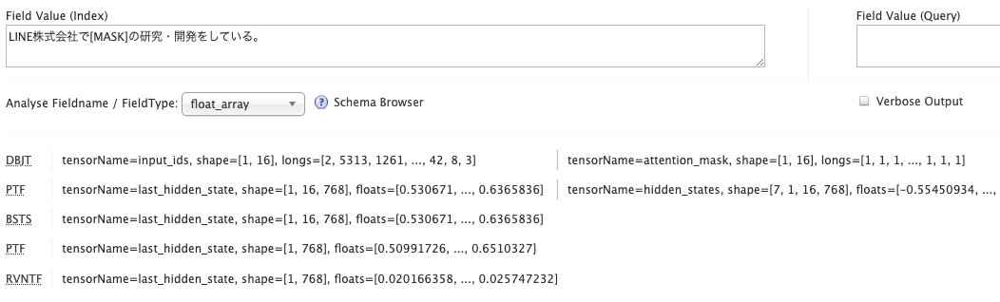

# solr-transformers

## Requirements

### Java Packages

- [demo_plugin_9.2.1](https://github.com/tmanabe/solr-plugin-samples/pull/1)
- [safetensors-java](https://github.com/tmanabe/safetensors-java)

### Python Packages

- torch
- transformers
- (For [LINE's DistilBERT](https://huggingface.co/line-corporation/line-distilbert-base-japanese))
  - sentencepiece
  - fugashi
  - unidic-lite

## Example

### Schema

```xml
  <fieldType name="float_array" class="io.github.tmanabe.demo2.FloatArrayField">
    <analyzer type="index">
      <tokenizer class="io.github.tmanabe.stream.DistilBertJapaneseTokenizerFactory"/>
      <filter class="io.github.tmanabe.stream.LineDistilBertTokenFilterFactory"/>
      <filter class="io.github.tmanabe.stream.ByStringTokenSelectorFactory" string="last_hidden_state"/>
      <filter class="io.github.tmanabe.stream.AveragePoolingTokenFilterFactory"/>
      <filter class="io.github.tmanabe.stream.ReflectableVectorNormalizerTokenFilterFactory"/>
    </analyzer>
```

### Analysis Screen


